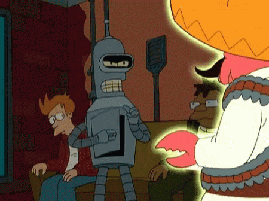

# Que onda 🤙

I am a Software Engineer/DevOps/FullStack Developer/SRE/Pizza Eater/RedBull Drinker. Love to learn, coding and automate stuff. "Why am I on this meeting" Kind of guy.

## Skills

### Languages

### Database

### Web Server

### Lets Connect

|  |  |
| ------------- | ------------- |

<!--
**LaunchRico/LaunchRico** is a ✨ _special_ ✨ repository because its `README.md` (this file) appears on your GitHub profile.

Here are some ideas to get you started:

- 🔭 I’m currently working on ...
- 🌱 I’m currently learning ...
- 👯 I’m looking to collaborate on ...
- 🤔 I’m looking for help with ...
- 💬 Ask me about ...
- 📫 How to reach me: ...
- 😄 Pronouns: ...
- ⚡ Fun fact: ...
-->
